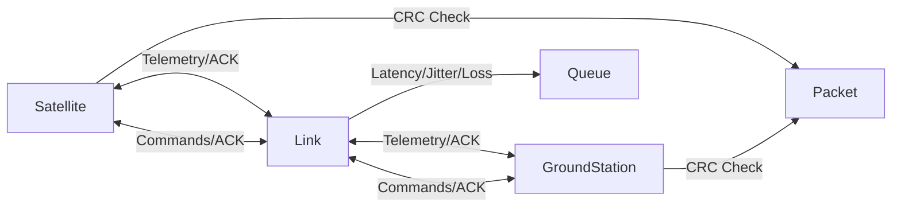

# Satellite Telemetry & Command Simulator

A production-quality C++20 satellite communication simulator featuring concurrent satellite and ground station threads communicating over a simulated radio link with realistic impairments (latency, jitter, packet loss), CRC-based integrity checks, ACK/NAK reliability protocol, and comprehensive command/telemetry handling.

## Motivation

> "To deepen my understanding of real-time and mission-critical systems, I built a C++ satellite telemetry simulator. It runs concurrent Satellite and GroundStation threads over a simulated link with latency, jitter, and packet loss. I implemented CRC, ACK/NAK retries, and a small command set (orientation adjustments, thrust burns, safe mode, reboot). The design emphasizes OOP, determinism, and reliability—exactly the patterns used in space software."

## 🏗️ Architecture



### Components

- **Satellite**: Autonomous spacecraft thread emitting periodic telemetry and executing received commands
- **GroundStation**: Earth-based control thread receiving telemetry and issuing commands
- **Link**: Bidirectional communication channel simulating radio link impairments
- **Packet**: Protocol data unit with header, payload, and CRC-16/CCITT-FALSE checksum
- **ThreadSafeQueue**: MPMC queue for inter-thread communication

## 📦 Features

### Telemetry
The satellite emits telemetry at configurable rates (default 5 Hz):
- `temperature_c`: Temperature in Celsius (with drift and anomaly detection)
- `battery_pct`: Battery level percentage (drains over time)
- `orbit_altitude_km`: Orbital altitude in kilometers (decays due to drag)
- `pitch_deg`, `yaw_deg`, `roll_deg`: Euler angles for attitude (subject to drift)

### Commands
Ground station can send four command types:
1. **AdjustOrientation**: Modify pitch/yaw/roll by specified deltas
2. **ThrustBurn**: Perform orbital maneuver (increases altitude, consumes battery)
3. **EnterSafeMode**: Force satellite into safe mode (blocks thrust burns)
4. **Reboot**: Reset satellite systems (clears safe mode)

### Reliability Model
- **CRC-16/CCITT-FALSE** checksum on all packets for integrity verification
- **Sequence numbers** for duplicate detection
- **ACK/NAK protocol**: Receiver confirms or rejects each packet
- **Automatic retries**: Configurable retry attempts (default 3) with timeout
- **Safe mode**: Automatically triggered on thermal (>85°C) or battery (<10%) anomalies

### Threading Model
- **Satellite thread**: Sends telemetry, processes commands, updates internal state
- **GroundStation thread**: Receives telemetry, sends periodic commands, logs data
- **Link**: Thread-safe queues with simulated delivery delays
- **Main thread**: Configuration, supervision, and metrics reporting

## 🚀 Build Instructions

### Prerequisites
- C++20 compliant compiler (GCC 10+, Clang 12+, MSVC 2019+)
- CMake 3.20 or higher
- Standard C++ library with threading support

### Build Steps

**Option 1: Using CMake (recommended)**
```bash
# Clone or extract repository
cd satcom-sim

# Create build directory
mkdir -p build
cd build

# Configure with CMake
cmake -DCMAKE_BUILD_TYPE=Release ..

# Build
make -j

# Run tests
./satcom_tests

# Run simulation
./satcom --duration-sec 20 --verbose
```

**Option 2: Using Make directly (if CMake unavailable)**
```bash
# Clone or extract repository
cd satcom-sim

# Build everything
make

# Run tests
./build/satcom_tests

# Run simulation
./build/satcom --duration-sec 20 --verbose
```

## 🎮 Usage

### Basic Usage

```bash
./satcom --duration-sec 15 --verbose
```

### All Command-Line Options

```
Options:
  --duration-sec N       Simulation duration in seconds (default: 20)
  --telemetry-rate-hz F  Telemetry emission rate in Hz (default: 5.0)
  --loss F               Packet loss probability 0..1 (default: 0.05)
  --latency-ms N         Mean link latency in ms (default: 100)
  --jitter-ms N          Latency jitter (std dev) in ms (default: 30)
  --ack-timeout-ms N     ACK timeout in ms (default: 150)
  --max-retries N        Maximum retry attempts (default: 3)
  --seed N               Random seed for determinism (default: 42)
  --log-file PATH        Telemetry log file path (default: telemetry.log)
  --verbose              Enable verbose logging
  --help                 Show this help message
```

### Example Scenarios

**High reliability, low latency:**
```bash
./satcom --duration-sec 20 --loss 0.01 --latency-ms 50 --jitter-ms 10 --telemetry-rate-hz 10 --verbose
```

**Challenging environment (high loss, high latency):**
```bash
./satcom --duration-sec 30 --loss 0.20 --latency-ms 200 --jitter-ms 80 --max-retries 5 --verbose
```

**Deterministic replay:**
```bash
./satcom --duration-sec 15 --seed 12345 --verbose
```

**Run example scenarios:**
```bash
cd build
chmod +x ../scripts/run_examples.sh
../scripts/run_examples.sh
```

## 📊 Sample Output

### Console Output (Verbose Mode)

```
=== Satellite Telemetry & Command Simulator ===
Duration: 15s
Telemetry rate: 5.0 Hz
Loss probability: 5%
Link latency: 100ms ± 30ms
ACK timeout: 150ms
Max retries: 3
Random seed: 42
Log file: telemetry.log
Verbose: yes
===============================================

Starting simulation...
[SAT] TX Telemetry seq=0 crc=0x3F2A temp=50.1C batt=90.0% alt=400.0km euler=(0.0,0.0,0.0)
[GS ] RX Telemetry seq=0 temp=50.1C batt=90.0% alt=400.0km → ACK
[GS ] CMD TX AdjustOrientation seq=0 d=(1.5,-0.8,0.3)
[SAT] CMD RX AdjustOrientation d=(1.5,-0.8,0.3) → applied
[GS ] RX ACK seq=0
[SAT] TX Telemetry seq=1 crc=0x4B8C temp=50.3C batt=89.9% alt=399.9km euler=(1.5,-0.8,0.3)
[GS ] RX Telemetry seq=1 temp=50.3C batt=89.9% alt=399.9km → ACK
[SAT] WARN: missed ACK for seq=2 → retry 1/3
[GS ] RX Telemetry seq=2 temp=50.5C batt=89.8% alt=399.9km → ACK
...
[GS ] CMD TX ThrustBurn seq=3 t=2.0s
[SAT] CMD RX ThrustBurn t=2.0s → applied
[GS ] RX ACK seq=3
...

Stopping simulation...

=== Simulation Metrics ===
Satellite:
  Telemetry sent: 73
  Commands received: 3
  Retries: 5
  NAKs received: 0

Ground Station:
  Telemetry received: 73
  Commands sent: 3
  Retries: 1
  NAKs sent: 0

Link:
  Packets sent: 158
  Packets dropped: 8
  Drop rate: 5.06%
==========================

Telemetry logged to: telemetry.log
```

### Telemetry Log File (telemetry.log)

CSV format with nanosecond timestamps:
```
timestamp_ns,temperature_c,battery_pct,orbit_altitude_km,pitch_deg,yaw_deg,roll_deg
1234567890123456,50.12,90.00,400.00,0.00,0.00,0.00
1234567890323456,50.34,89.98,399.99,1.52,-0.82,0.31
1234567890523456,50.56,89.96,399.98,1.48,-0.79,0.28
...
```

## 🧪 Testing

The test suite ([tests/basic_tests.cpp](tests/basic_tests.cpp)) includes:
- **CRC-16/CCITT-FALSE** validation with known test vectors
- **ThreadSafeQueue** concurrency stress test (1000 items, producer/consumer)
- **Packet serialization** roundtrip (encode → decode → verify)
- **CRC verification** with intentional corruption
- **Telemetry/Command serialization** roundtrip
- **Link loss probability** statistical validation (1000 packets)
- **End-to-end smoke test** (zero loss, full handshake)

Run tests:
```bash
cd build
./satcom_tests
```

Expected output:
```
=== Running Satellite Simulator Tests ===

Running test: test_crc16_known_vectors...
  ✓ PASSED
Running test: test_thread_safe_queue_basic...
  ✓ PASSED
Running test: test_thread_safe_queue_concurrency...
  ✓ PASSED
...

9/9 tests passed

✓ All tests passed!
```

## 🔧 How to Extend

### Add a New Telemetry Field

1. Add field to `Telemetry` struct in [include/telemetry.hpp](include/telemetry.hpp)
2. Update `to_json()` and `from_json()` serialization
3. Update `to_csv()` and `csv_header()` for logging
4. Modify `Satellite::update_state()` to compute new field
5. Adjust `Satellite::send_telemetry()` to populate field

### Add a New Command Type

1. Add enum value to `CommandType` in [include/commands.hpp](include/commands.hpp)
2. Add parameters to `Command` struct
3. Update `serialize()` and `deserialize()` methods
4. Implement handler in `Satellite::process_commands()` switch statement
5. Add ground station logic in `GroundStation::send_periodic_commands()`

### Implement New Reliability Policy

Modify [include/link.hpp](include/link.hpp) and [src/link.cpp](src/link.cpp):
- **Priority queues**: Add priority field to `Packet`, sort queues
- **FEC (Forward Error Correction)**: Encode/decode in `Packet` serialization
- **Selective repeat ARQ**: Track individual packet ACKs instead of sequential
- **Bandwidth throttling**: Add sleep in `apply_impairments_and_send()`

### Add Backpressure Handling

In `ThreadSafeQueue`:
- Add max capacity limit
- Block `push()` when full or drop lowest priority items
- Signal backpressure to sender

## 📁 Repository Structure

```
.
├── CMakeLists.txt              # Root CMake configuration
├── README.md                   # This file
├── include/                    # Public headers
│   ├── satellite.hpp           # Satellite class
│   ├── ground_station.hpp      # Ground station class
│   ├── link.hpp                # Simulated radio link
│   ├── packet.hpp              # Network packet structure
│   ├── crc.hpp                 # CRC-16 implementation
│   ├── thread_safe_queue.hpp   # MPMC queue
│   ├── commands.hpp            # Command types and serialization
│   └── telemetry.hpp           # Telemetry structure and serialization
├── src/                        # Implementation files
│   ├── satellite.cpp
│   ├── ground_station.cpp
│   ├── link.cpp
│   ├── packet.cpp
│   ├── crc.cpp
│   └── main.cpp                # Entry point and CLI
├── tests/                      # Test suite
│   ├── CMakeLists.txt
│   └── basic_tests.cpp         # Unit and integration tests
└── scripts/                    # Helper scripts
    └── run_examples.sh         # Demo scenarios
```

## 🛡️ System Design  

### Object-Oriented Design
- **Encapsulation**: Each class owns its state and exposes minimal public API
- **RAII**: Threads automatically joined in destructors; file handles auto-closed
- **Separation of concerns**: Link doesn't know about Satellite/GroundStation semantics

### Concurrency & Thread Safety
- **No data races**: All shared state protected by mutexes or atomics
- **Condition variables**: Efficient blocking on empty queues (no busy-waiting)
- **Graceful shutdown**: Atomic flags allow clean thread termination

### Reliability & Determinism
- **Seeded RNG**: Reproducible simulations for debugging
- **CRC integrity**: Industry-standard polynomial (used in XMODEM, Bluetooth)
- **Retry logic**: Exponential opportunities with configurable limits
- **Sequence numbers**: Detect duplicates and reordering

### Real-World Patterns
- **Protocol design**: Header/payload/footer structure mirrors real protocols
- **Safe mode**: Autonomous fault response (thermal/power anomalies)
- **State machines**: Implicit in command processing and retry logic
- **Telemetry logging**: CSV format for post-mission analysis

### Testing & Quality
- **Unit tests**: CRC, serialization, queue behavior
- **Integration tests**: End-to-end packet flow
- **Statistical validation**: Loss probability within tolerance
- **No external dependencies**: Portable, auditable, deployable

## 📝 Design Choices

1. **Why this project?** Demonstrates systems programming, concurrency, and reliability—core skills for aerospace software
2. **Design choices:** Standard library only (no dependencies), deterministic behavior, clean separation of concerns
3. **Challenges solved:** Thread-safe queues, realistic latency simulation, CRC implementation, retry logic
4. **Production-ready aspects:** Comprehensive testing, error handling, metrics, logging, extensive configuration
5. **Extensibility:** Easy to add new commands, telemetry fields, or reliability policies

## 🔗 References

- **CRC-16/CCITT-FALSE**: Polynomial 0x1021, Init 0xFFFF ([spec](http://reveng.sourceforge.net/crc-catalogue/16.htm#crc.cat.crc-16-ccitt-false))
- **C++20 Standard**: [cppreference.com](https://en.cppreference.com/)
- **CMake Documentation**: [cmake.org](https://cmake.org/documentation/)